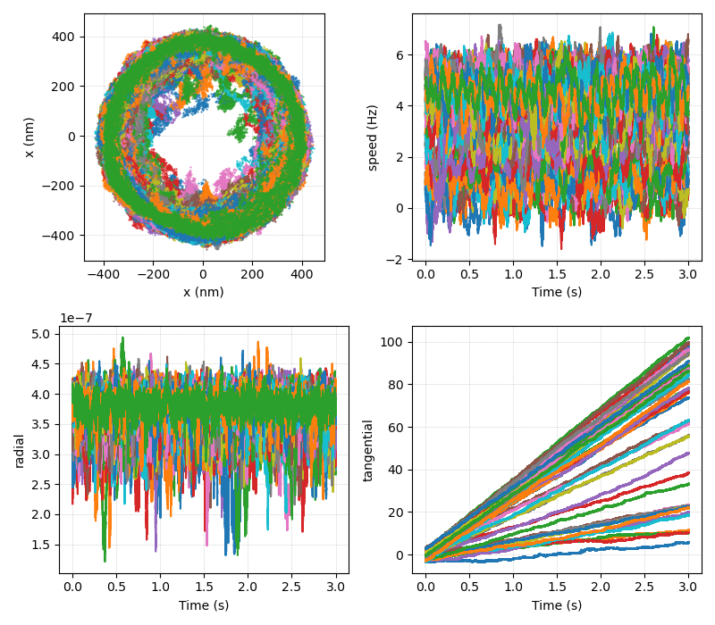
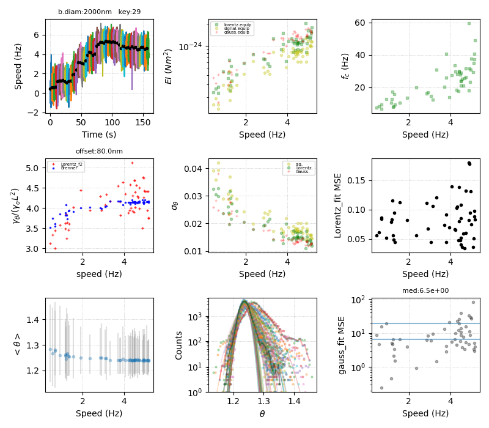
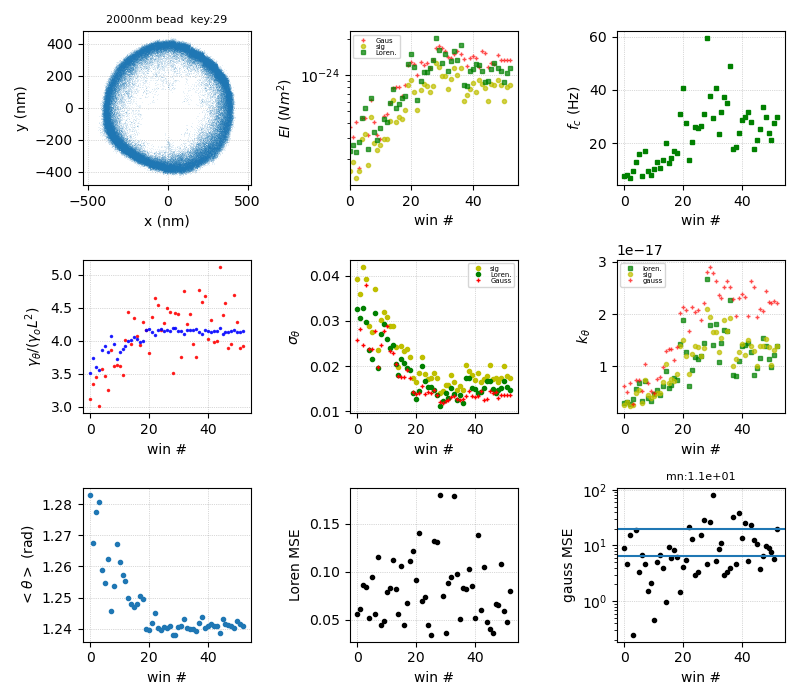

## Dynamic stiffening of the flagellar hook

Ashley L. Nord, Anais Biquet-Bisquert, Manouk Abkarian, Théo Pigaglio,  
Farida Seduk, Axel Magalon, and Francesco Pedaci

Centre de Biologie Structurale, CNRS, INSERM, Univ.  Montpellier, France.  
Aix Marseille Universite, CNRS, Laboratoire de Chimie Bacterienne Marseille, France.

Contact: francesco.pedaci -AT- cbs.cnrs.fr

Preprint : <https://arxiv.org/abs/2106.15435>


## Software overview


We provide here the source code at the base of the analysis described in our work. Two example experimental traces are also provided to test the output of the code.


#### Content
```
file2000res.npy                 Two experimental data traces
Drag/DragRotatingBead.py        Scripts to calculate the drag coefficient of
Drag/DragTranslationBead.py  	    a rotating and translating sphere
filters.py                      Signal processing, filtering, smoothing
fitEllipse.py                   Fit ellipse to x,y data
noise_bfm.py                    Main analysis
openTDMS.py                     Read .tdms files (not used in the examples)
PSpectrum.py                    Power Spectral Density of a signal
utils.py                        Various 
```

#### Dependencies
The code has been tested on a PC running Debian Linux (4.19.0-17-amd64 #1 SMP Debian 4.19.194-2 (2021-06-21) x86_64 GNU/Linux), with 8 Intel Xeon CPU E5-1620 v2 (3.70 GHz).
The code runs in Python 3.7.11, and we used the ipython (7.26.0)  console. The following imports are necessary:
```
    matplotlib 3.4.2
    numpy 1.20.3
    scipy 1.6.2
```

#### Accessing the example data
The content of the example file needs to extracted in a terminal:

        $ 7z e file2000res.npy.7z

This creates the file `file2000res.npy`. In ipython the data can be accessed by

        data = load('file2000res.npy', allow_pickle=1).item()

The object `data` is a dictionary with keys (20, 29). The value of each key is again a dictionary, corresponding to one measurement on an individual motor and bead. Its keys are 

```
‘strain’		strain name
‘cellnum’		measurement number
'FPS'			Frames Per Second of the camera
‘x’, ‘y’		x,y position of the bead center in each time point, in pixel units
‘stator’		type of stator (WT: wild type)
‘nm_per_px’		pixel size conversion factor 
```
The content of `data` is the following dictionary:
```
{20: 
 {'strain': 'MT03',
  'cellnum': 'CL_180828_183950_xythetaROI0',
  'FPS': 10000.0,
  'dbead_nm': 2000,
  'x': array([5.60051109, 5.5774342 , 5.60936609, ..., 2.3257502 , 2.34367477,
         2.35231171]),
  'y': array([1.78207918, 1.79937524, 1.73658298, ..., 2.72624579, 2.7821482 ,
         2.80057767]),
  'stator': 'WT',
  'nm_per_pix': 98.0},
  
 29: 
 {'x': array([34.90380243, 34.85262809, 34.90295628, ..., 32.3905964 ,
         32.37766435, 32.40861705]),
  'y': array([67.12387766, 67.19290839, 67.17724887, ..., 65.54918043,
         65.51845002, 65.4972709 ]),
  'z': array([1304.75636848, 1304.75636848, 1308.55277878, ..., 1330.53968112,
         1330.01458466, 1327.79936427]),
  'FPS': 10000,
  'cellnum': 'CL_200627_191532_ROI1',
  'strain': 'MT03',
  'stator': 'WT',
  'dbead_nm': 2000,
  'nm_per_pix': 91.3}}
```

#### Running the analysis on the example traces

The analysis of the hook stiffness on a single trace can be run by the following commands in ipython:

```
import noise_bfm

# analysis of 1st file:
nb = noise_bfm.BFMnoise(filename='file2000res.npy', key=29)

nb.xy_fluctuations_theta(win_s=3, center_win_traj=1, stretch_xy=1, correct_win_mod=1, plots_lev=[1,2,5], correct_drift_xy=0, use_xyz=0, c0=265000, c1=-500000, offset=80e-9, psd_c1=-5)

# analysis of 2nd file:
nb = noise_bfm.BFMnoise(filename='file2000res.npy', key=20)

nb.xy_fluctuations_theta(win_s=3, center_win_traj=1, stretch_xy=1, correct_win_mod=1, plots_lev=[1,2,5], correct_drift_xy=0, use_xyz=0, c0=100000, c1=1500000, offset=60e-9, psd_c1=-5)
```

For the 1st file, the command above will produce in few minutes the plots shown in the following pages











